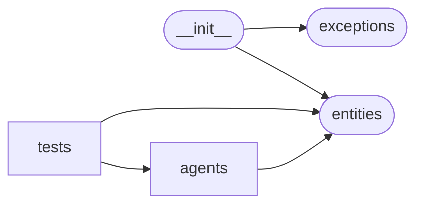

# Code Overview

[_Documentation generated by Documatic_](https://www.documatic.com)

<!---Documatic-section-Codebase Structure Python-start--->
## Codebase Structure Python

The codebase has a 2-deep folder structure,
                with 22 code files in total.

<!---Documatic-block-system_architecture-start--->

<!---Documatic-block-system_architecture-end--->

# #
<!---Documatic-section-Codebase Structure Python-end--->

<!---Documatic-section-Key Objects-start--->
## Key Objects

There are exposed imports at level-0
from the source directory (pyinstagram)

<!---Documatic-block-pyinstagram-start--->

	
<code>pyinstagram</code> (Click to Expand!)

* `pyinstagram.entities.Account`
* `pyinstagram.entities.Comment`
* `pyinstagram.entities.Entity`
* `pyinstagram.entities.EntityConstructor`
* `pyinstagram.entities.HasMediaEntity`
* `pyinstagram.entities.Location`
* `pyinstagram.entities.Media`
* `pyinstagram.entities.Story`
* `pyinstagram.entities.Tag`
* `pyinstagram.entities.UpdatableEntity`
* `pyinstagram.exceptions.AuthException`
* `pyinstagram.exceptions.CheckpointException`
* `pyinstagram.exceptions.IncorrectVerificationTypeException`
* `pyinstagram.exceptions.InstagramException`
* `pyinstagram.exceptions.NotUpdatedElement`

<!---Documatic-block-pyinstagram-end--->

# #
<!---Documatic-section-Key Objects-end--->

<!---Documatic-section-Important Functions-start--->
## Important Functions

<!---Documatic-block-important_funcs-start--->
<!---Documatic-block-most_used_funcs-start--->
### Most Utilised Functions

* [pyinstagram.agents.utils.sync](5-pyinstagram_agents.md#pyinstagram.agents.utils.sync) (4 times)
<!---Documatic-block-most_used_funcs-end--->

<!---Documatic-block-end_user_funcs-start--->
### End User Exposed Functions

* [pyinstagram.entities.Entity](3-pyinstagram_entities.md#pyinstagram.entities.Entity)
* [pyinstagram.entities.Location](3-pyinstagram_entities.md#pyinstagram.entities.Location)
* [pyinstagram.entities.Account](3-pyinstagram_entities.md#pyinstagram.entities.Account)
* [pyinstagram.entities.EntityConstructor](3-pyinstagram_entities.md#pyinstagram.entities.EntityConstructor)
* [pyinstagram.entities.Story](3-pyinstagram_entities.md#pyinstagram.entities.Story)
* [pyinstagram.exceptions.NotUpdatedElement](4-pyinstagram_exceptions.md#pyinstagram.exceptions.NotUpdatedElement)
* [pyinstagram.exceptions.InstagramException](4-pyinstagram_exceptions.md#pyinstagram.exceptions.InstagramException)
* [pyinstagram.entities.Tag](3-pyinstagram_entities.md#pyinstagram.entities.Tag)
* [pyinstagram.entities.UpdatableEntity](3-pyinstagram_entities.md#pyinstagram.entities.UpdatableEntity)
* [pyinstagram.entities.Media](3-pyinstagram_entities.md#pyinstagram.entities.Media)
* [pyinstagram.entities.HasMediaEntity](3-pyinstagram_entities.md#pyinstagram.entities.HasMediaEntity)
* [pyinstagram.entities.Comment](3-pyinstagram_entities.md#pyinstagram.entities.Comment)
* [pyinstagram.exceptions.CheckpointException](4-pyinstagram_exceptions.md#pyinstagram.exceptions.CheckpointException)
* [pyinstagram.exceptions.AuthException](4-pyinstagram_exceptions.md#pyinstagram.exceptions.AuthException)
* [pyinstagram.exceptions.IncorrectVerificationTypeException](4-pyinstagram_exceptions.md#pyinstagram.exceptions.IncorrectVerificationTypeException)
<!---Documatic-block-end_user_funcs-end--->
<!---Documatic-block-important_funcs-end--->

# #
<!---Documatic-section-Important Functions-end--->

<!---Documatic-section-File IO-start--->
## File IO

<!---Documatic-block-file_io-start--->
The following files have file read operations

<!---Documatic-block-pyinstagram.tests-start--->

	
<code>pyinstagram.tests</code> (Click to Expand!)

* pyinstagram.tests.config

<!---Documatic-block-pyinstagram.tests-end--->
<!---Documatic-block-file_io-end--->

# #
<!---Documatic-section-File IO-end--->

<!---Documatic-section-Class Hierarchy-start--->
## Class Hierarchy

<!---Documatic-block-pyinstagram.entities.Account-start--->

	
<code>pyinstagram.entities.Account</code> (Click to Expand!)

* pyinstagram.agents.async_mobile_account_agent.AsyncMobileAccountAgent
* pyinstagram.agents.async_web_account_agent.AsyncWebAccountAgent

<!---Documatic-block-pyinstagram.entities.Account-end--->

<!---Documatic-block-pyinstagram.entities.Entity-start--->

	
<code>pyinstagram.entities.Entity</code> (Click to Expand!)

* [pyinstagram.entities.Comment](3-pyinstagram_entities.md#pyinstagram.entities.Comment)
* [pyinstagram.entities.Story](3-pyinstagram_entities.md#pyinstagram.entities.Story)
* [pyinstagram.entities.UpdatableEntity](3-pyinstagram_entities.md#pyinstagram.entities.UpdatableEntity)

<!---Documatic-block-pyinstagram.entities.Entity-end--->

<!---Documatic-block-pyinstagram.entities.HasMediaEntity-start--->

	
<code>pyinstagram.entities.HasMediaEntity</code> (Click to Expand!)

* [pyinstagram.entities.Account](3-pyinstagram_entities.md#pyinstagram.entities.Account)
* [pyinstagram.entities.Location](3-pyinstagram_entities.md#pyinstagram.entities.Location)
* [pyinstagram.entities.Tag](3-pyinstagram_entities.md#pyinstagram.entities.Tag)

<!---Documatic-block-pyinstagram.entities.HasMediaEntity-end--->

<!---Documatic-block-pyinstagram.entities.UpdatableEntity-start--->

	
<code>pyinstagram.entities.UpdatableEntity</code> (Click to Expand!)

* [pyinstagram.entities.HasMediaEntity](3-pyinstagram_entities.md#pyinstagram.entities.HasMediaEntity)
* [pyinstagram.entities.Media](3-pyinstagram_entities.md#pyinstagram.entities.Media)

<!---Documatic-block-pyinstagram.entities.UpdatableEntity-end--->

<!---Documatic-block-pyinstagram.exceptions.AuthException-start--->

	
<code>pyinstagram.exceptions.AuthException</code> (Click to Expand!)

* [pyinstagram.exceptions.CheckpointException](4-pyinstagram_exceptions.md#pyinstagram.exceptions.CheckpointException)
* [pyinstagram.exceptions.IncorrectVerificationTypeException](4-pyinstagram_exceptions.md#pyinstagram.exceptions.IncorrectVerificationTypeException)

<!---Documatic-block-pyinstagram.exceptions.AuthException-end--->

# #
<!---Documatic-section-Class Hierarchy-end--->

[_Documentation generated by Documatic_](https://www.documatic.com)