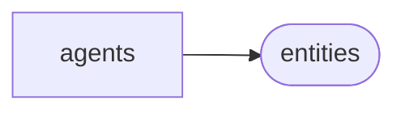

# Pyinstagram Agents

[_Documentation generated by Documatic_](https://www.documatic.com)

<!---Documatic-section-Codebase Structure-start--->
## Codebase Structure

<!---Documatic-block-system_architecture-start--->

<!---Documatic-block-system_architecture-end--->

# #
<!---Documatic-section-Codebase Structure-end--->

<!---Documatic-section-pyinstagram.agents.utils.sync-start--->
## [pyinstagram.agents.utils.sync](5-pyinstagram_agents.md#pyinstagram.agents.utils.sync)

<!---Documatic-section-sync-start--->
<!---Documatic-block-pyinstagram.agents.utils.sync-start--->
<details>
	<summary><code>pyinstagram.agents.utils.sync</code> code snippet</summary>

```python
def sync(coroutine):

    def wrapper(*args, **kwargs):
        loop = asyncio.get_event_loop()
        future = coroutine(*args, **kwargs)
        if not loop.is_running():
            return loop.run_until_complete(future)
        return future
    return wrapper
```
</details>
<!---Documatic-block-pyinstagram.agents.utils.sync-end--->
<!---Documatic-section-sync-end--->

# #
<!---Documatic-section-pyinstagram.agents.utils.sync-end--->

[_Documentation generated by Documatic_](https://www.documatic.com)